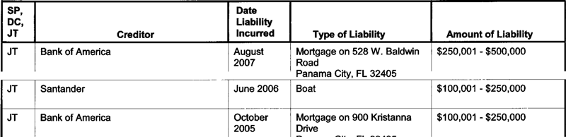
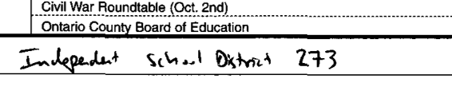
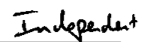
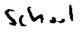

## PDF Liberation Hackathon - House of Representative Personal Financial Disclosures

### 1st Option - Electronically Submitted Reports

#### Background and Challenge
Members of the House of Representatives submit a yearly report on their personal finances. Though this
report is often submitted electronically, it is only made available in PDF form on the Clerk of the House's
website. The challenge is to find a reliable and sustainable way to extract the information entered on
the form, to define the grid, and to OCR each piece of entered information. This is especially challenging
because the form shifts with downloads and content.

#### PDFs
We have downloaded a couple samples of House of Representative Personal Financial Disclosures into a
[dropbox account](https://www.dropbox.com/sh/60o6nxoayve6f14/2hztdzK5ox). Because we have chosen relatively short PDFs, we would like to see the entire PDF
processed. We've provided a couple different PDFs to demonstrate how the form can shift based on the
content entered, and the way it is scanned and downloaded.

#### Output
The data needs to be extracted in a **tab-delimited** file, and we would like software created that is flexible
enough to use on this huge body of files (435 members who file every year). Because each PDF has so
many different sections and columns, how the tab delimited file is created will be left up to the
participant. All the fields in the PDF should be considered mandatory, except for the first page of each
PDF.

##### Example:
The following field appears on Representative Southerland's Schedule V:

Output text file:

<pre>	Member	Sch	SP,DC,JT	Creditor	Date	Type	Amount
	N00031204	V	JT	Bank	of	America	etc&hellip;
	N00031204	V	JT	Santander
	N00031204	V	JT	Bank	of	America
</pre>

**Note: Participant is free to name sections of the form, and pick values (yes/no, true/false, etc) as long as they are not ambiguous. The member ID can be taken from the file name.**

#### Why This Matters

For the first time since we began collecting this data, the majority of Members of Congress are now millionaires. Constituents have a right to know how their representatives are making their money and if they are getting rich while in office. But, because of how the information is disclosed, a member's financial information is typically two years old by the time the public easily search through it. The lag is caused by our need to hand-enter this data, some of which is very complicated. If we can process this information faster, we can bring the public more timely information on their elected officials. And we could even begin to process disclosures made by staff, which help the public could learn just what interests may be influencing elected officials. Currently, OpenSecrets does not have the capacity to process these filings, because we spend so much time processing the yearly member filings.

### 2nd Option - Handwritten Reports

#### Background and Challenge
Members of the House of Representatives submit a yearly report on their personal finances. Though
there is the option to submit the report electronically, some Members choose to download the report and hand enter their information. The challenge for these reports is to build a CAPTCHA type program that will allow us to crowd-source the data entry for these fillings. The CAPTCHA program will need to split the PDF into readable bits and know what each bit means (the field in the form). It is also important for this program to not split a word from the PDF mid-letter.

#### PDFs
We have downloaded a couple samples of House of Representative Personal Financial Disclosures into a
[dropbox account](https://www.dropbox.com/sh/60o6nxoayve6f14/2hztdzK5ox). We've provided a couple different PDF to demonstrate how different the forms can look based on how a Member writes their information into the form.

#### Output
The data needs to be extracted in a tab delimited file, and we would like software created that is flexible enough to use on this difficult body of files. Because each PDF has so many different sections and columns, how the tab delimited is created will be left up to the participant. The first page of the PDF does not need to be entered into the data. The PDFs can be entered into the same file and distinguished by their unique ID which is an identifier that OpenSecrets.org uses for Members of Congress. The unique ID is the name of the PDF followed by the year the report was filed. The year field should also be included in the tab delimited file. For this challenge it won't be considered mandatory to enter all the data from the PDFs, only to show that the software can split the file into small bits of handwriting that can be used in a CAPTCHA or another crowdsource solution. The challenge is knowing what question on the form the handwriting is from, and making sure it's split along a word boundary.

##### Example:
The following field appears on Erik Paulsen's form A:

Output Image file:

N00029391_Sch1_Ln1_Wd1.png

N00029391_Sch1_Ln1_Wd2.png

(Etc.)

**Note: Member ID comes from the name of the file. Image file names may be used to keep track of which field the image is from.**

Please feel free to email me with any question you have along the way! mdiemer@crp.org